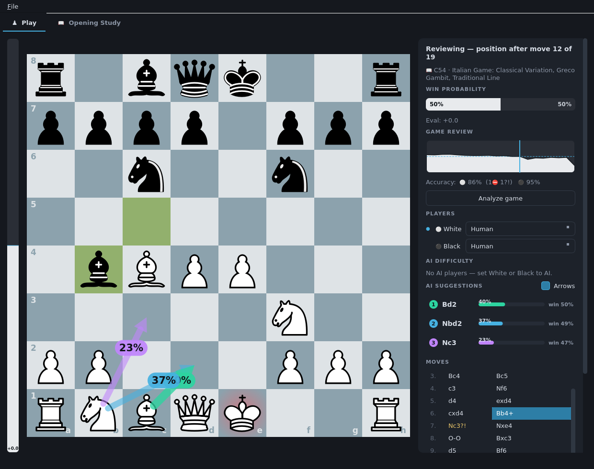

# Chess Studio

**🇰🇷 [한국어 문서 (Korean)](README.ko.md)**

An offline chess GUI with Stockfish 18 built in — play, get coached in real
time, review your games chess.com-style, and turn your own mistakes into a
personal tactics trainer. No account, no network, no installation.

**▶ [Download the latest Windows build](https://github.com/wogur110/chess-game/releases/latest)**
— extract the zip and run `ChessStudio\ChessStudio.exe`.

```bash
# …or run from source (Linux/Windows)
pip install -r requirements.txt
python download_stockfish.py   # one-time, ~110 MB; offline afterwards
python main.py
```

## What it looks like

| Play | Opening Study | Game Review |
|---|---|---|
|  |  |  |

## Features

### Play
- **Human or AI per color** — Human vs AI, AI vs AI (pausable), or two humans;
  switch any time, even mid-game. The board auto-flips so your side is at the
  bottom.
- **10 difficulty levels** (~800 Elo → 3200+), set **independently per color**;
  defaults to level 7 (Master · 2300).
- **Live analysis while you play** — win-probability bar next to the board
  and the opening name (ECO) recognized as you play. The engine's top-3
  suggested moves (arrows + probabilities) are **off by default** for a
  normal-game experience — flip the "Suggestions" checkbox to see them. The
  analysis engine always runs at full strength, whatever the difficulty.
- **Game library** — finished games are archived automatically as PGN under
  `saves/library/`; the Library tab lists them (players, result, opening)
  and reopens any of them in the Play tab.

### Training
- **Coach mode** — when your move throws away 10%+ of your win chance, the
  AI's reply is held and a banner offers **Take back** (retry yourself),
  **Show why** (the refutation as a red arrow), or **Keep move**. Immediate
  feedback at the exact moment of the mistake.
- **Threat radar** — hold `T` to see what the opponent is threatening: red
  arrows for their best moves if you passed, red rings on your hanging
  pieces. Find the threats yourself first, then check.
- **Replay from a mistake** — any miss/mistake/blunder in the review gets a
  "⟲ Replay from here" button: the game is backed up to `saves/`, the board
  rewinds to just before the error, and you play it out against the engine.
- **Tactics tab: puzzles from your own games** — after a review, every
  mistake with a verified unique best answer becomes a puzzle card. Re-solve
  the exact position you misplayed; each card shows which game it came from.
- **Spaced repetition** — puzzles are scheduled in Leitner boxes
  (1/3/7/21/60 days): clean solves move up, fails come back tomorrow. The
  tab badge shows what's due; **Review due** runs today's queue.
- **Cross-game mistake insights** — every reviewed mistake is classified
  offline by phase (opening/middlegame/endgame) and pattern (hung a piece,
  missed a mate, missed a fork, …) and logged persistently; the Library tab
  aggregates them into "your most common pattern is X" style feedback.
- **Puzzle rush & themed practice** — a bundled starter pack of ~3,600
  curated Lichess puzzles (CC0, fully offline): **Rush** gives you 3 strikes
  / 3 minutes with escalating difficulty and a best-score record, and
  **Practice** drills one motif at a time (fork, pin, back-rank mate, …) in
  random order — tactics volume from day one, before your own mistake deck
  fills up.
- **Estimated puzzle rating** — every rush/practice attempt updates an
  Elo-style estimate (clean solve = win, wrong move or hint = loss), with
  the full attempt history persisted so the number tracks your record over
  time.

### Review
- **Chess.com-style game review** — move grades (**Brilliant `!!` / Great `!`
  / Best / Book / Inaccuracy `?!` / Miss `✕` / Mistake `?` / Blunder `??`**),
  per-side accuracy, and "best was …" for every graded move.
- **Eval graph** of the whole game with colored dots at the key moments —
  click anywhere to jump to that move.
- **Save / load PGN** (evaluations included); navigating back is
  non-destructive, and playing a new move from a past position branches there.

### Opening study
- **Full ECO tree built in** — 3,726 named lines, 148 families, searchable.
- **Master-game statistics** — win/draw/loss rates and per-move popularity
  from TWIC games (both players 2200+), transposition-aware (EPD-keyed).
- **Demo and drill** — step through any line, then drill it as White or Black
  (wrong moves get the correct arrow and a miss counter), or drill freely
  against the whole book. One click continues the position vs the AI.

### Interface
- Dark modern GUI (PySide6/Qt), drag & drop or click-click moves.
- **English / 한국어** — switch in *Options → Language / 언어*.
- Remembers players, difficulty, checkboxes, tab, window size and language.
- Fully offline; no sound.

## Controls

| Action | How |
|---|---|
| Make a move | Drag a piece, or click it then click the target square |
| Step through the game | `←` / `→`, `Home` / `End`, or the ◀ ▶ buttons |
| One move back (mouse) | Right-click the board |
| Undo | `Ctrl+Z` or the Undo button |
| New / Save / Load game | `Ctrl+N` / `Ctrl+S` / `Ctrl+O` |
| Review the whole game | "Analyze game" in the sidebar |
| Retry a mistake | "⟲ Replay from here" under the move detail |
| Toggle coach warnings | "Coach" checkbox in the sidebar |
| Peek at opponent threats | Hold `T` (or the "Threats" checkbox) |
| Retrain your mistakes | Tactics tab → "Review due" |
| Puzzle rush / themed practice | Tactics tab → "Start rush" / "Practice" |
| Show engine suggestions | "Suggestions" checkbox in the sidebar (off by default) |
| Browse archived games / insights | Library tab (finished games auto-save there) |
| Drill an opening | Opening Study tab → pick a line → "Start drill" |
| Change the language | Options menu → Language / 언어 |

## Building

### Windows (automated, recommended)

[`.github/workflows/build-windows.yml`](.github/workflows/build-windows.yml)
builds on every push/PR: it downloads Stockfish, smoke-tests the code, builds
with PyInstaller, and smoke-tests the resulting `.exe`.

- Every run uploads `ChessStudio-windows-x64-<version>.zip` as a build
  artifact.
- Pushing a version tag publishes a GitHub **Release** with the zip attached:

  ```bash
  git tag v1.7.0
  git push origin v1.7.0
  ```

### Locally

```bat
build_windows.bat      REM on Windows -> dist\ChessStudio\ChessStudio.exe
```
```bash
./build_linux.sh       # on Linux
```

PyInstaller cannot cross-compile — build each OS on itself. The whole
`dist/ChessStudio` folder is the app (Stockfish included, works offline).

## Project layout

```
main.py                  entry point
app/
  theme.py               dark theme palette + Qt stylesheet
  i18n.py                UI translations (English/한국어)
  eval_utils.py          engine score -> win probability (Stockfish WDL model)
  engine_manager.py      two Stockfish processes (playing / analysis) + verify jobs
  game_controller.py     game state, coach mode, review, puzzle mining
  board_widget.py        board rendering, arrows, threat overlay
  sidebar.py             win bar, suggestions, move list, review controls
  opening_book.py        bundled opening DB loader (EPD-keyed)
  opening_tab.py         opening study tab (browser, demo/drill, stats)
  puzzle_store.py        personal tactics deck (mined mistakes + Leitner scheduling)
  puzzle_pack.py         bundled starter-pack loader (rush / themed practice)
  puzzle_rating.py       Elo-style estimated puzzle rating (persistent)
  tactics_tab.py         tactics tab (mistake deck, puzzle rush, themed practice)
  game_library.py        automatic PGN archive of finished games
  insights.py            cross-game mistake classification + persistent log
  library_tab.py         library tab (archived games + training insights)
  main_window.py         assembles everything (Play / Opening / Tactics / Library)
  data/openings.json.gz  opening tree + master-game statistics (committed)
tools/
  build_opening_data.py  opening DB rebuild pipeline (dev-only, needs network)
  build_puzzle_pack.py   puzzle starter-pack builder (dev-only, needs network)
engines/                 Stockfish 18 binaries (Linux / Windows)
saves/                   saved games and replay backups (PGN)
```

## Data sources

- Rush/practice puzzles: the [Lichess puzzle database](https://database.lichess.org/#puzzles)
  (CC0) — ~3,600 well-tested puzzles sampled across rating bands and themes;
  rebuild with `python tools/build_puzzle_pack.py`.
- Opening names/lines: [lichess-org/chess-openings](https://github.com/lichess-org/chess-openings) (CC0)
- Win-rate statistics: [The Week in Chess](https://theweekinchess.com) weekly
  PGN archives (TWIC 1549–1648), games with both players rated 2200+. Many
  thanks to TWIC for keeping these archives free.
- `app/data/openings.json.gz` is committed, so users never need to rebuild
  it. To refresh: `python tools/build_opening_data.py all`.
