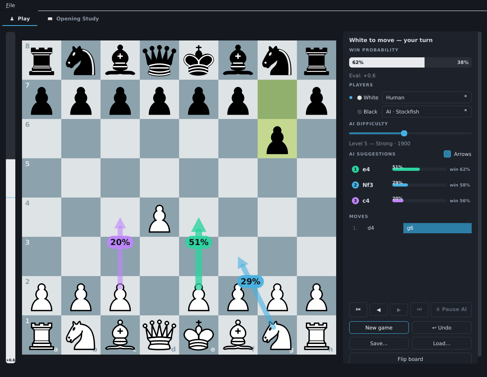
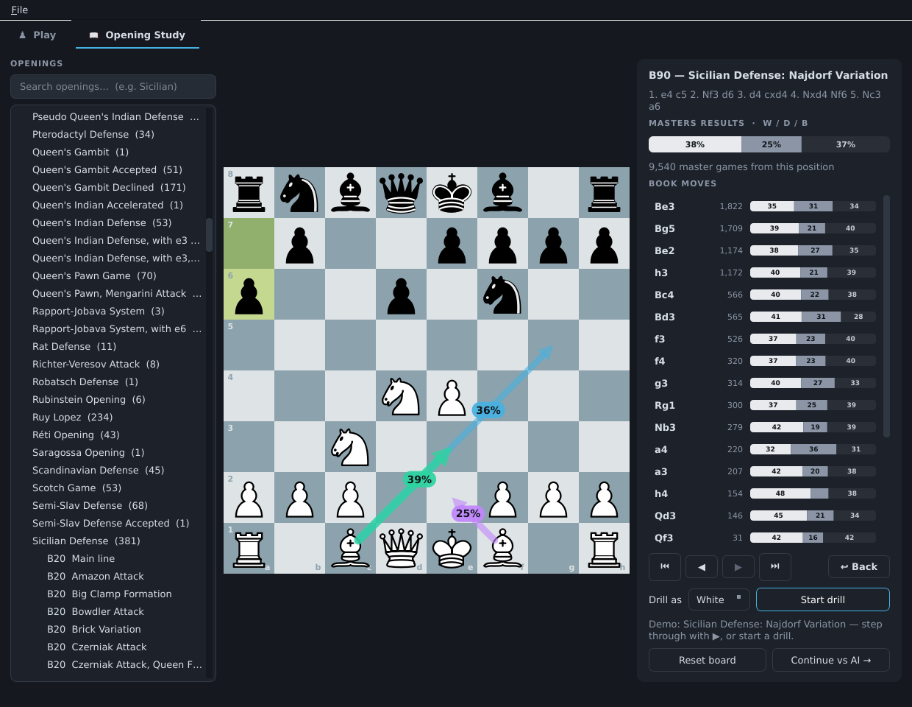

# Chess Studio

An offline-only chess GUI with Stockfish 18 built in: play against the AI,
see suggested moves with probabilities, watch live win-rate analysis, tune
the difficulty, and review saved games.

**▶ [Download the latest Windows build](https://github.com/wogur110/chess-game/releases/latest)**
— extract the zip and run `ChessStudio\ChessStudio.exe`. No installation, fully offline.
(See [all releases](https://github.com/wogur110/chess-game/releases).)

## Screenshots

**Play against Stockfish** — a live win-probability bar, the top-3 candidate
moves drawn as arrows with their probabilities, an adjustable difficulty
slider, and the move list. White / Black can each be set to Human or AI at any
time, and the board flips so your side is always at the bottom.



**Opening study** — browse the full ECO tree on the left, replay any line on
the board, and read master-game win rates (White / Draw / Black) plus per-move
statistics for every position. Pick a side and drill the line, then hand the
position to the Play tab to finish the game against the engine.



## Features

- **Dark modern GUI** — PySide6 (Qt) based; move pieces by drag & drop or click-click
- **AI move suggestions with probabilities** — the top 3 candidate moves are shown
  every turn as arrows with percentage badges
  - Recommendation probability (rec %): relative strength among the candidates
  - Winning probability (win %): the mover's expected score after that move
- **Win-probability sidebar** — white/black winning chances as a gauge and numbers
  after every move, plus a vertical evaluation bar next to the board
- **Adjustable AI difficulty** — 10 slider levels, from beginner (~800 Elo) to
  full strength (3200+)
- **Mode switching, even mid-game** — pick Human / AI per color
  - Human vs AI, AI vs AI, and Human vs Human all work
  - With exactly one human, the board auto-flips so the human side is always
    at the bottom
  - AI vs AI can be paused / resumed
- **Undo** — against an AI opponent it rewinds to your previous turn automatically
- **Review / save** — games are saved as PGN (with evaluations); load one and step
  through it with ◀ ▶. Playing a new move from a past position branches from there
- **Opening study tab** — the full ECO tree built in (3,726 named lines,
  148 families)
  - Search and pick an opening, then **demo** it move by move with ▶
  - **Drill mode** — memorize the selected opening by playing it yourself
    (choose White/Black, the opponent advances automatically, wrong moves get
    the correct arrow and a miss counter). With no opening selected, drill
    freely against the whole book
  - **Variations and win rates** — every position shows white/draw/black
    percentages and game counts from master games (TWIC, both players
    2200+ Elo), with per-move statistics bars. Transpositions are recognized
    automatically (positions are keyed by EPD)
  - **Continue vs AI after the book ends** — one button hands the position to
    the Play tab to finish the game against Stockfish at the current difficulty
- No sound, no network connection needed (fully offline)

## Running from source

```bash
pip install -r requirements.txt
python download_stockfish.py   # one-time: downloads the Stockfish 18 binaries
python main.py
```

The Stockfish binaries (~110 MB each) are not in the repository because of
GitHub's file-size limit. `download_stockfish.py` places them at
`engines/linux/stockfish` (Linux) / `engines/windows/stockfish.exe` (Windows).
If they are missing, a `stockfish` found on the system PATH is used instead.
After the download, everything runs fully offline.

## Getting a Windows build

### Option A — automated build via GitHub Actions (recommended)

The repository ships a workflow at
[`.github/workflows/build-windows.yml`](.github/workflows/build-windows.yml)
that builds the Windows executable on a `windows-latest` runner. It runs on
every push/PR to `main`, can be started manually from the **Actions** tab
("Build Windows executable" → *Run workflow*), and is fully self-contained —
it downloads Stockfish, smoke-tests the code on Windows, builds with
PyInstaller, then smoke-tests the resulting `.exe`.

- **Any run** uploads `ChessStudio-windows-x64-<version>.zip` as a build
  *artifact* (download it from the run's summary page).
- **Pushing a version tag** publishes a GitHub *Release* with the zip attached
  on the [Releases page](https://github.com/wogur110/chess-game/releases):

  ```bash
  git tag v1.0.0
  git push origin v1.0.0
  ```

To run the result: download the zip, extract it, and run
`ChessStudio\ChessStudio.exe`. The whole folder is the app — no installer.

### Option B — build locally on Windows

Copy the project folder to a Windows PC, then run:

```bat
build_windows.bat
```

The build produces `dist\ChessStudio\ChessStudio.exe`. To distribute it, copy
the whole `dist\ChessStudio` folder (Stockfish included, works offline).

> PyInstaller cannot cross-compile, so the Windows executable must be built on
> Windows. Use `./build_linux.sh` for the Linux build.

## Controls

| Action | How |
|---|---|
| Make a move | Drag a piece, or click it then click the target square |
| One move forward/back (review) | `←` / `→` or the ◀ ▶ buttons in the sidebar |
| One move back (mouse) | Right-click the board (cancels the selection instead while a piece is selected) |
| Jump to start/end | `Home` / `End` |
| Undo | `Ctrl+Z` or the Undo button |
| New game / Save / Load | `Ctrl+N` / `Ctrl+S` / `Ctrl+O` |
| Toggle suggestion arrows | "Arrows" checkbox in the sidebar |
| Play a suggested move | Click its row in the sidebar |
| Study openings | Opening Study tab → pick an opening on the left |
| Step through an opening demo | ▶ button or `→` (clicking a book-move row also works) |
| Drill an opening | Choose your side, then "Start drill" |

## Layout

```
main.py                  entry point
app/
  theme.py               dark theme palette + Qt stylesheet
  eval_utils.py          engine score -> win probability (Stockfish WDL model)
  engine_manager.py      manages two Stockfish processes (playing / analysis)
  game_controller.py     game state, modes, undo, save/review
  board_widget.py        board rendering, drag & drop, suggestion arrows
  sidebar.py             win bar, suggestions panel, move list, controls
  opening_book.py        bundled opening DB loader (EPD-keyed, transposition-aware)
  opening_tab.py         opening study tab (browser, demo/drill, stats panel)
  data/openings.json.gz  opening tree + master-game statistics (committed)
  main_window.py         assembles everything (Play / Opening Study tabs)
tools/
  build_opening_data.py  opening DB rebuild pipeline (dev-only, needs network)
engines/                 Stockfish 18 binaries (Linux / Windows)
saves/                   saved games (PGN)
```

## Opening data sources

- Opening names/lines: [lichess-org/chess-openings](https://github.com/lichess-org/chess-openings) (CC0)
- Win-rate statistics: [The Week in Chess](https://theweekinchess.com) weekly PGN
  archives (TWIC 1549–1648, roughly two years), counting only games where both
  players are rated 2200+. Many thanks to TWIC for keeping these archives free.
- `app/data/openings.json.gz` is committed to the repository, so regular users
  never need to rebuild it. To refresh it: `python tools/build_opening_data.py all`.

The analysis engine always runs at full strength regardless of the difficulty
setting, so win rates and suggestions stay accurate even when you play against
a weak AI level.
